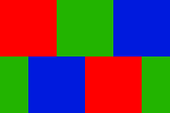

# Shadow Masks for [MiSTer FPGA](https://github.com/MiSTer-devel/Main_MiSTer/wiki)

This repository contains the Shadow Mask files for the MiSTer FPGA.

## Instructions

Create a folder named `Shadow_Masks` in the root of your MicroSD Card along with the other folders like "filters", "games", etc... Place the .txt Shadow Mask files into that folder.

## Color Palette

| Color | Value | Bits |
| --- | --- | --- |
| Gray | 0 | 000 |
| Blue | 1 | 001 |
| Green | 2 | 010 |
| Cyan | 3 | 011 |
| Red | 4 | 100 |
| Magenta | 5 | 101 |
| Yellow | 6 | 110 |
| White | 7 | 111 |

Max width = 8  
Max Height = 8

## How It Works

Here's an example. If you wanted to make RGB dots that use this pattern:



Then you would make a file like this:

```
# w,h
6,4

# lut
4,4,2,2,1,1
4,4,2,2,1,1
2,1,1,4,4,2
2,1,1,4,4,2
```

These numbers correspond to the following r, g, b values like this:

```
r,r,g,g,b,b
r,r,g,g,b,b
g,b,b,r,r,g
g,b,b,r,r,g
```
